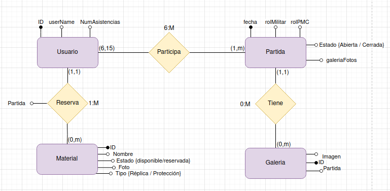

Software

Python versión 3.10.12, Django versión 3.2.23, Bootstrap versión 5.3, Pillow versión 10.1.0, SQLite 3.37, djangorestframework versión 3.14.0.

Descripción del proyecto

Aplicación de gestión de una empresa de airsoft. Esta empresa proporciona un campo de juego para practicar el deporte, en el que se dividen en dos equipos y cada uno tiene un rol (militar y terrorista).

Cada fin de semana se abren partidas, serán dadas de alta, editadas o eliminadas por parte del administrador, los usuarios podrán reservar su plaza en el equipo que deseen y en caso de no haber más plazas en ese equipo no se le permitirá hacer la reserva.
El día antes que se vaya a jugar la partida, si los equipos están descompensados serán reorganizados de forma aleatoria.

La empresa también permite alquilar el equipo de juego, diferentes réplicas, protecciones que serán escogidas por el usuario en función de su disponibilidad. Esto se ofrecerá al cliente a la hora de realizar la reserva en la partida.

El administrador podrá subir fotos de la partida para que los jugadores puedan descargarlas, también podrá sacar informes de las personas que más han asistido y las que menos.

*han habido cambios en el modelo.

Desarrollo del Proyecto Integrado.

Home muestra una página principal con un carrousel y muestra las partidas que están abiertas para apuntarse. Dependiendo si el usuario está logado o no, tendrá diferentes accesos a otras páginas. Al igual que ocurre con admin.

CRUD de partida que permite al admin crear partidas nuevas, editarlas, eliminarlas. Las partidas estarán también visibles para usuarios logados.

En la esquina superior derecha podemos registrarnos como nuevos usuarios, logarnos o deslogarmos. Justo al lado de los botones muestra el nombre del usuario.

Un usuario logado podrá apuntarse a una partida en la que no se haya apuntado previamente, y que no haya superado el total de jugadores de la partida concreta. Tendrá la opción de reservar el material en función de su disponibilidad.

El día antes de la partida si hay más jugadores en un equipo que en el otro el administrador podrá pulsar un botón que de forma aleatoria reestructurará los equipos.

Hay una galería que muestra la foto de partidas y podrán ser descargadas.

Admin tiene acceso a una pestaña Informe que muestra un top tres de usuarios que más han asistido y un top tres que menos hayan asistido a jugar.

Finalmente, he construido dos APIS. El admin accede mediante una pestaña que redirecciona a /api/v1/ donde encontramos ambas APIS. Si se accediera sin estar logado, poniendo la url directamente en el navegador, controlo que la API de reservas no pueda ser leída.